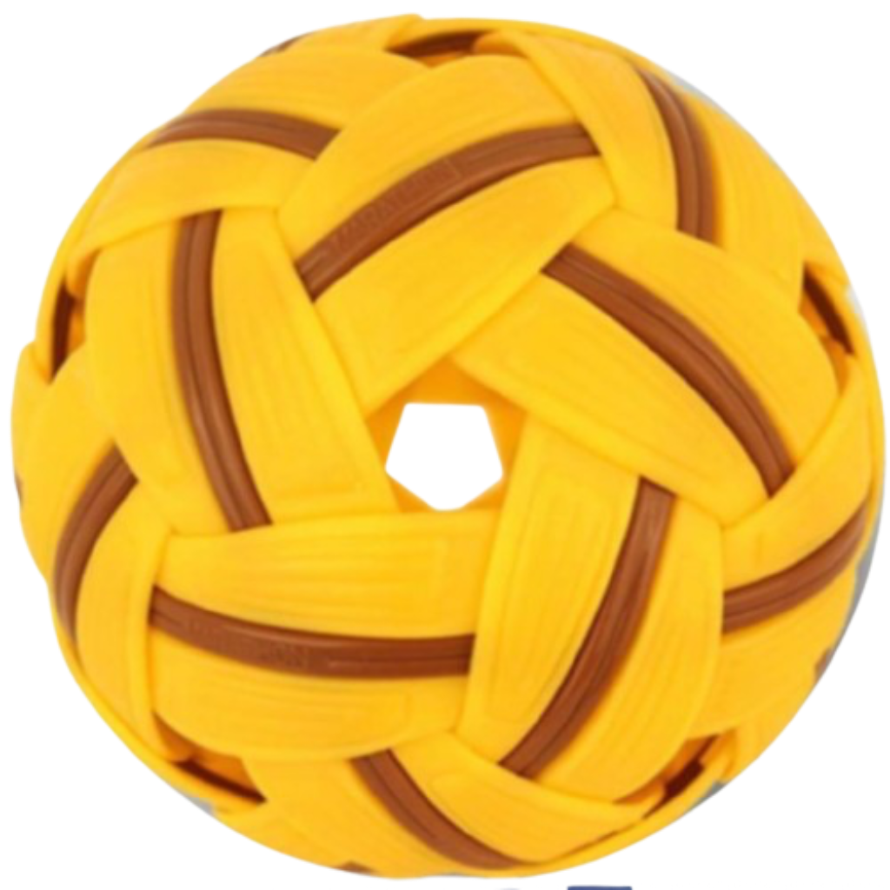

<a href="https://www.takbuff.com">

<h3 align="center">Takbuff</h3>
</a>

 An open-source <b>Sepak Takraw</b> community application licensed by Aburv. It features news, articles and live coverage of sepak takraw matches including text commentary, player stats and team rankings.

## Our AIM

A approach to converge Sepak Takraw with software excellence to
- Publicize and promote the game
- Experience the digitalized scoring  
- Insightful stats on players and matches

## Contributions

We appreciate our contributors. This codebase is focused towards openness of developer community.

🤝We expect everyone, trying to help our community to develop robust app, to agree to our Code of Conduct. 
  Begin with our Contributor's Guide. will get updated soon! 

At Aburv, we believe

`Lets be the part of something bigger`

## Lets build together.