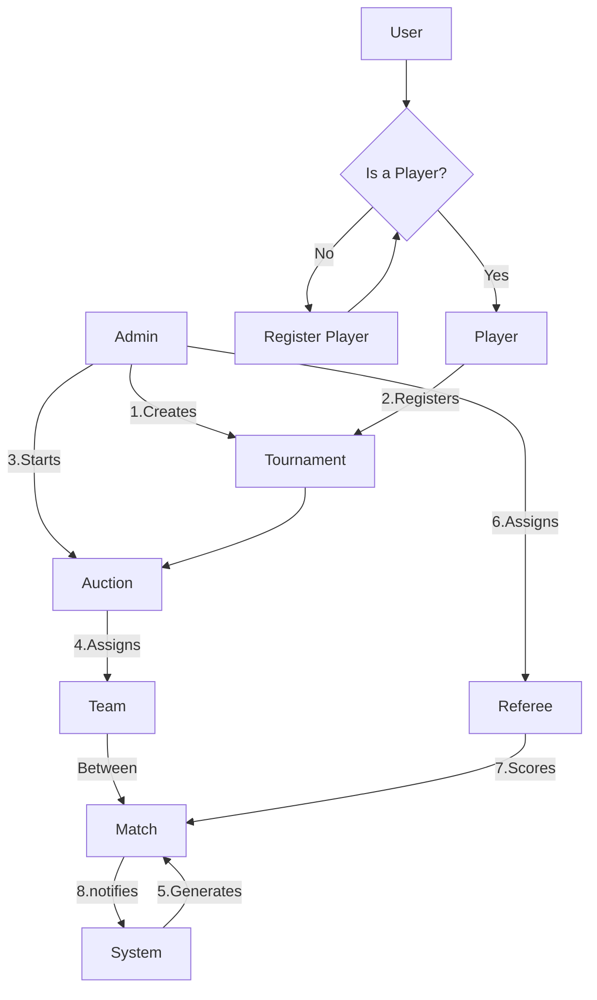
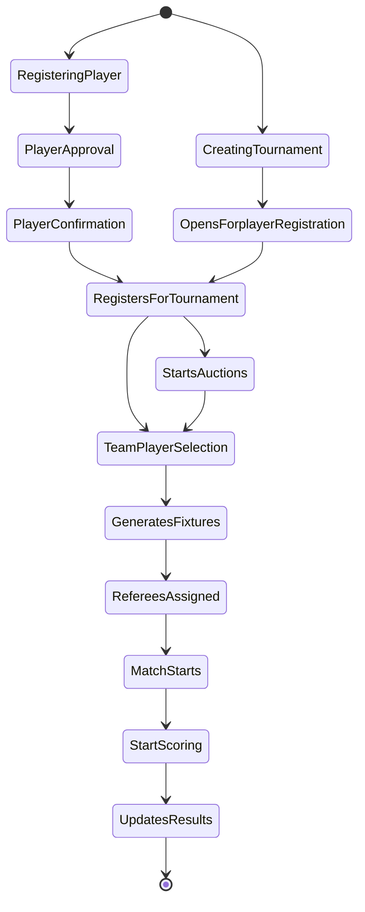
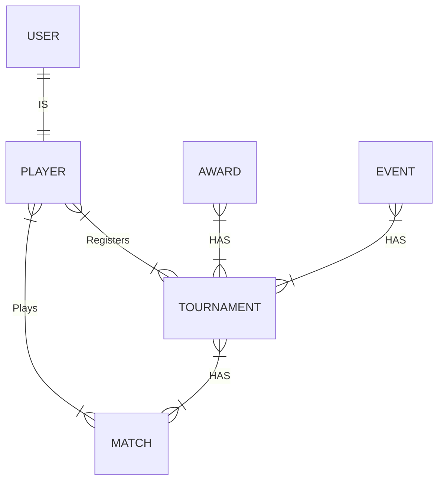
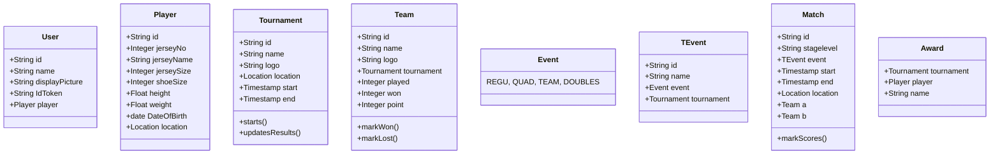
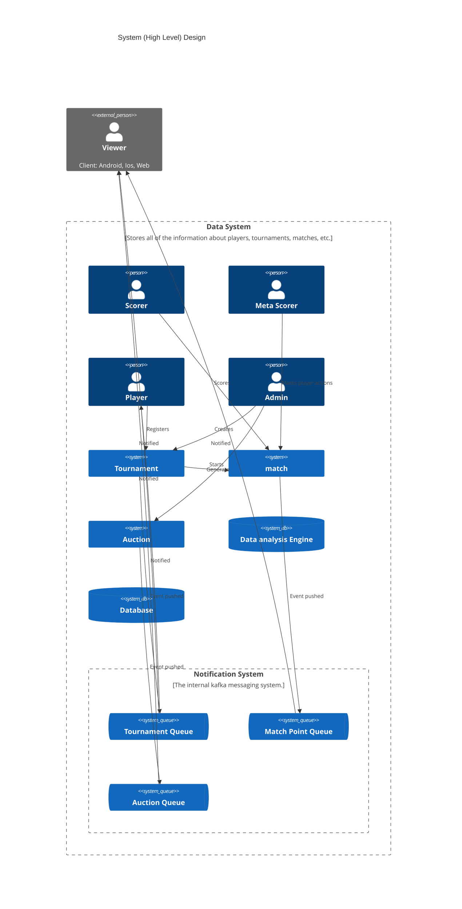

## Flow Diagram

## State Diagram



## ER Diagram



## Class Diagram



## User Diagram

```mermaid
sequenceDiagram
  Signed in User->>Player: Register
  Admin->>Player: Approves
  note right of Admin: Creates Tournament
  System->>Player: notifies
  System->>(Signed/Unsigned users) Viewers: notifies
  note right of Player: Registers
  note right of Admin: Starts Auction or team selecttion
  note right of System: Generates fixtures
  System->>(Signed/Unsigned users) Viewers: notifies
  Admin->>Referee: Assigns to match
  note right of Admin: Starts Match
  note right of Referee: Scores
  note right of System: Updates results
  System->>(Signed/Unsigned users) Viewers: notifies
```

## C4 Diagram


