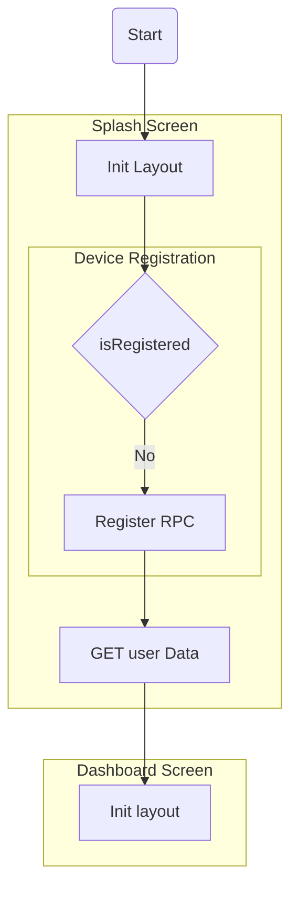

## Interface Flow Diagram (IOS/Android/Browser)

```mermaid
flowchart TD
    A(Start) --> AA[Init Layout]
    subgraph Splash Screen
      AA --> AB{isRegistered}
      subgraph Device Registration
        AB --> |No| AC[Register RPC]
      end
      AC --> AD[GET user Data]
    end
    AD --> BA
    subgraph Dashboard Screen
      BA[Init layout]
    end
```